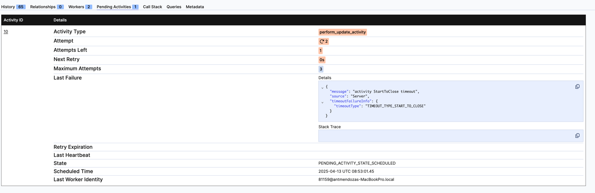

# System Patch Workflow

The file [System_Patching.md](./src/workflow/System_Patching.md) provides an overview of the functionality that will 
be implemented in this workshop.


## [system_patch_workflow_v1.py](src/workflow/system_patch_workflow_v1.py)
This file contains the basic implementation as a set of activities to be executed in the workflow.

Open the file and review the implementation.

Every step defined in the file [System_Patching.md](./src/workflow/System_Patching.md) is defined as an activity,
except the step 2 (SendApprovalRequestActivity and wait for approval) which is missing and will be added as part of the first
exersice.


## Project structure

- The folder `workflow` contains the implementation of the workflow/s and the activities. 
- [temporal_client.py](../temporal_client.py) is responsible for sending the request to start the workflow and interact with it (e.g. send signals).
- [temporal_worker.py](../temporal_worker.py) is responsible for running the workflow and activities, this is our application.
- [activities.py](activities.py) contains the activity implementations
- [types.py](types.py) workflow and activity input/output types.


Everytime you start working on a new exersice (system_patch_workflow_vx.py) you will need to: 
- stop the worker [temporal_worker.py](../temporal_worker.py) and register the new workflow implementation which corresponds to function name. (e.g. `SystemPatchWorkflow_V2`->`SystemPatchWorkflow_V3`).
- change the workflow type in the [temporal_client.py](../temporal_client.py) to send the request for the new workflow type (same as above).

You won't have to do it if you are just modifying your own implementation.

# Workshop


Each exercise’s final implementation is in the next version of the file (v1, v2, and so on).


## Exersice 0 - Environment setup

Make sure you can run the workflow [system_patch_workflow_v1.py](src/workflow/system_patch_workflow_v1.py)

- Start the temporal server
- Start the worker [temporal_worker.py](../temporal_worker.py)
- Start the client [temporal_client.py](../temporal_client.py)
- Check the UI
  - http://localhost:8233 for [Temporal CLI](https://docs.temporal.io/cli)
  - http://localhost:8080 for the [Temporal docker-compose](https://github.com/temporalio/docker-compose)


## Exersice 1 - Message passing (Signal/Update)
During this exercise, you will implement the step 2 : "Execute SendApprovalRequestActivity. If not approved, terminate."

You can use the file [system_patch_workflow_v1.py](src/workflow/system_patch_workflow_v1.py) as starting point:

- Add the invocation to SendApprovalRequestActivity
- In order to interact with the workflow to send the approval response, you need to add a signal or update handler to the workflow.
The main difference is that signal is asynchronous and update is synchronous.
  - https://docs.temporal.io/develop/python/message-passing#signals
  - https://docs.temporal.io/develop/python/message-passing#updates
  - Additionally, you can add a timeout to `workflow.await` to react if the approval response takes too long. 
    - If a timer times out it throws a TimeoutError, which you [have to catch and handle](https://github.com/temporalio/sdk-python/issues/798). 
    - To fail the workflow, you can re-throw the error as an `temporalio.exceptions.ApplicationError`
  - If the timeout is reached you can decide either fail the workflow or complete it.

- Modify the client to send the signal or update to the workflow after the workflow is started.
  - https://docs.temporal.io/develop/python/message-passing#send-signal
  - https://docs.temporal.io/develop/python/message-passing#send-update-from-client

**Run the code**
Restart the worker and the client, the workflow should complete after several seconds, go to the UI and check the progress.


### Exersice 1.1 Inspect the workflow history
Spend some time inspecting the workflow history in the UI.

Note that the implementation of some activities is designed to fail during the first retry (ej. `check_service_health_activity`).

Open the workflow history in the UI, click on its ActivityTaskStarted and ActivityTaskComplete and 
check the information in the fields `Attemps` and `LastFailure`.


## Exersice 2 - Workflow query
Imagine you need to check periodically the steps that has been completed for each execution. 

Workflow queries allow us to retrieve state from a Workflow Execution.

You can use the file [system_patch_workflow_v2.py](src/workflow/system_patch_workflow_v2.py) as starting point:

- Create an internal variable to store the steps, e.g. `completed_steps = []` and modify the workflow to append the 
completed steps to this variable.
- Add a query handler to the workflow to return it.
  - https://docs.temporal.io/develop/python/message-passing#queries
- Modify the client to call the query handler to get the completed steps every x seconds.
  - https://docs.temporal.io/develop/python/message-passing#send-query

**Run the code**
Restart the worker and the client, the workflow should complete after several seconds, 
go to the UI and check the progress.
 


## Exersice 3 - Activity Timeouts and heartbeat
Temporal allows you to set timeouts to activities and also to send heartbeats from them, this is 
useful to react quickly to worker failures and to resume the activity execution from when it was interrupted.

There are different types of activity timeouts. For this exercise, let's focus on 
[start_to_close timeout](https://docs.temporal.io/encyclopedia/detecting-activity-failures#start-to-close-timeout) 
and [heartbeats](https://docs.temporal.io/encyclopedia/detecting-activity-failures#activity-heartbeat).

Some activities can be long-running, let's use `perform_update_activity` for this exersice.

You can use the file [system_patch_workflow_v3.py](src/workflow/system_patch_workflow_v3.py) as starting point.

### Exersice 3.1 Start to close timeout

- Review the `perform_update_activity` activity options, where the method `perform_update_activity` is called, note
that `start_to_close_timeout` is set to 10 seconds. 
- Modify the activity implementation to add a `await asyncio.sleep` > 10 seconds.

**Run the code**
- Restart the worker and the client
- Open the workflow execution in the UI and go to the pending activities tab.
  - Note that the activity is retried after the timeout. 
    - You can modify the default retry policy and set initial_interval, backoff_coefficient etc.




  - After 3 retries the activity fails with ActivityTaskTimedOut


- Add a log to the start of the activity `perform_update_activity`
  - `activity.logger.info("***Starting perform_update_activity***")`

**Run the code**
- Restart the worker and the client
- Check the worker logs, note that the activity is retried after the timeout (+ initial_interval + backoff_coefficient * attempt)


- In the UI we can see that the activity execution latency is > 30 seconds (from schedule to close)


Let's see what happen if a worker crashes while executing an activity.

### Exersice 3.2 Heartbeat

Temporal allows you to send heartbeats from activities, this is useful to react quickly to worker failures and to resume
the activity execution quickly.


#### Add heartbeat to detect worker failures
- Modify `perform_update_activity`: 
  - Remove the `await asyncio.sleep` added in 3.1
  - Add a loop to iterate 9 times and send a heartbeat every second.
    - https://docs.temporal.io/develop/python/failure-detection#activity-heartbeats
    - https://python.temporal.io/temporalio.activity.html#heartbeat
  - Add the logic to continue the activity execution from the last heartbeat if the activity is retried.
    - https://python.temporal.io/temporalio.activity.Info.html#heartbeat_details
    - https://docs.temporal.io/encyclopedia/detecting-activity-failures#throttling

- Modify the activity options to add heartbeat timeout to 2 seconds.
  - `heartbeat_timeout=timedelta(seconds=2)` 

**Run the code**
- Run the client to start the workflow
- Run worker and restart it after the first heartbeat.
  - the script [sh_restart_worker.sh](sh_restart_worker.sh) might be useful.
- The activity will be re-scheduled after 2 seconds (heartbeat timeout) and start running again once the worker is up.


- Check `lastfailure` in the UI.


## Exersice 4 - Concurrency
Temporal allows running multiple activities (or child workflows as we will see later) in parallel, 
this is useful to reduce the execution time of the workflow when there are multiple independent tasks to be executed.

You can use the file [system_patch_workflow_v4.py](src/workflow/system_patch_workflow_v4.py) as starting point:

- Modify the workflow to process target clusters (search _#4. For each `targetCluster`_ ) and
 host (methods `_process_pilot_hosts` and `_process_remaining_hosts`) in parallel, use
 `asyncio.gather` to run the branches in parallel.
  - https://github.com/temporalio/samples-python/blob/7a1dd4d623244a54170ec1b9952af84d8e5acc3e/hello/hello_parallel_activity.py#L20

**Run the code**
- Restart the worker and the client
- Check the UI, note that the workflow execution time is reduced compared to the previous execution.


Click the gear icon ⚙️ in the bottom-right corner of the UI to add or remove columns

## Exersice 5 - Child workflows
Child workflows are feature that allows you to spawn a workflow from another workflow. There are several 
use cases for this feature, for example to 
[represent each resource as a workflow](https://docs.temporal.io/child-workflows#represent-a-single-resource)
(like a cluster or hosts).

You can use the file [system_patch_workflow_v5.py](src/workflow/system_patch_workflow_v5.py) as starting point

Modify the workflow to spawn a child workflow for each target cluster:
- Refactor the method `SystemPatchWorkflow_V5._process_target_cluster` to spawn a child workflow for each target cluster.
  - https://docs.temporal.io/develop/python/child-workflows

**Run the code**
- Restart the worker and the client
- Check the UI, tab Relationships to check the workflow execution tree.

  


- Additionally, in the new child workflow code, you can refactor the method `_process_host` and move the implementation to a new child workflow (as we did with clusters)


## Exersice 6 - Cancellation and cancellation scope
The new requirement is that if updating one of the hosts fails, we want to cancel the update of the other hosts in the same cluster.

In Temporal ["Cancellation is done using asyncio task cancellation"](https://github.com/temporalio/sdk-python?tab=readme-ov-file#asyncio-cancellation).

You can use the file [system_patch_workflow_v6.py](src/workflow/system_patch_workflow_v6.py) as starting point:

We will make first one of the child workflows fail, and then add the logic to the workflow to cancel the other child workflows.

- Modify one of the method that performs operations in the host to make it fail (e.g. `check_host_preconditions_activity`) , 
there are a couple of options:
  - add a `await asyncio.sleep(t)` (where t > start_to_close) to make it timeout, after 3 retries the activity will be marked as 
  failed and the error will be propagated to the caller, being the caller the child workflow SystemPatchWorkflow_Host_V7 in this case. 
  - From the activity throw a non-retryable error, this will make the activity fail immediately.
  ```
  await asyncio.sleep(3)
  raise ApplicationError("-", non_retryable=True)
  ```
- Modify the method `SystemPatchWorkflow_Cluster_V7._process_hosts` to capture the exception (ChildWorkflowFailure) and 
cancel the other child workflows.
  - https://github.com/temporalio/sdk-python?tab=readme-ov-file#asyncio-cancellation


**Run the code**
- Restart the worker and the client
- Check the UI, one of the child workflows should fail and the other should be cancelled.


## Exersice 6 - Worker configuration

//TODO the idea is to configure the worker to throttle the activities and show the effect in metrics


# Further reading:

- Local activities: 
  - https://docs.temporal.io/local-activity

- Workflow versioning: Renaming the workflow type is one of the approaches you can take to add changes to an existing implementation, but not the only one: 
  - https://docs.temporal.io/develop/python/versioning
  - https://learn.temporal.io/courses/versioning/

- Activity Timeouts:
  - https://docs.temporal.io/encyclopedia/detecting-activity-failures
  - https://www.youtube.com/watch?v=JK7WLK3ZSu8

- Workflow - Cancellation vs Termination:
  - https://docs.temporal.io/develop/python/cancellation

- Testing
  - https://docs.temporal.io/develop/python/testing-suite

- Workflow Execution Limits
  - https://docs.temporal.io/workflow-execution/limits